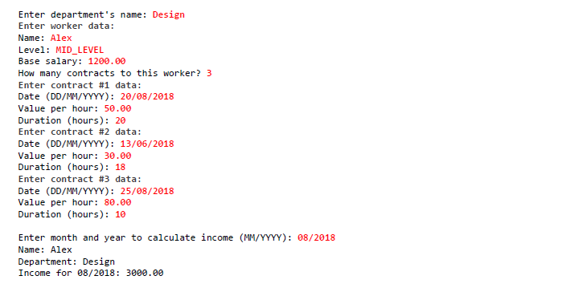

# Olá DEVS

Resolvi este exercício sobre composição onde coloquei em prática meus conhecimentos de orientação a objetos, trabalhar com datas em JAVA, trabalhar com List em JAVA e como funciona a composição de Objetos. Possuir compreensão sobre como funcionam os Objetos compostos na memória conforme foi muito bem explicado nas aulas do curso que estou realizando. Segue a especificação 👇

Ler os dados de um trabalhador com N contratos (N fornecido pelo usuário). Depois, solicitar do usuário um mês e mostrar qual foi o salário do funcionário nesse mês.
Temos um diagrama de Classe UML que é representado por 3 Classes:

A Classe `Worker` que possui atributos e métodos como:
- -name: String
- -level: WorkerLevel (enum)
- -baseSalary: Double
- -department: Department
- -contracts: List<'HourContract'>
---
- +addContract (contract: HourContract) : void
- +removeContract (contract: HourContract) : void
- +income (month: Integer, year: Integer) : Double
---

A Classe `HourContract` que possui atributos e métodos como:
- -date: LocalDate
- -valuePerHour: Double
- -hours: Integer
---
- +totalValue( ) : Double
---

A Classe `Department` que possui apenas um atributos:
- -name: String
---

O enum `WorkerLevel` está representado com os valores:
- JUNIOR
- PLENO
- SENIOR
--- 
A Classe `Worker` possui duas associações: `Department` e `HourContract` - onde o tipo `Department` só pode ser atribuído uma instância do Objeto e o tipo `HourContract` pode ser uma lista com 0..N instâncias do Objeto.

### Como resolvi?

Fiz a criação das Classe necessárias, implementei seus atributos e métodos úteis, inclusive construtores. 

Adicionei em cada Classe seus respectivos getters, não adicionei setters para implementar segurança e consistência nas variáveis de instância de cada Objeto para garantir que um Objeto externo não modifique-os. Apenas irei adicionar setters se realmente for necessário, mas de começo optei por deixar sem.

Basicamente o que mais tive que implementar foram as lógicas no métodos de cada Classe: 

O método `addContract` da Classe `Worker` utilizei uma lógica bem simples, ele é responsável apenas por adicionar uma instância do Objeto `HourContract` na Lista de contratos (atributo) da Classe `Worker`. 

O método `removeContract` segue o mesmo fluxo porém ele irá remover uma instância de um Objeto `HourContract` da Lista de contratos (atributo) da Classe `Worker`.

O método `income` é responsável por retornar um valor Double que representa o total recebido em um mês/ano informado pelo usuário somado com o salário base que está no atributo. Utilizei uma lógica um pouco mais complexa, implementei um filtro para retornar uma Lista de `HourContract` que possuem apenas mês e ano iguais respectivamente as variáveis de parâmetros que foram recebidas no método:
```java
List<HourContract> contractsFilters = contracts.stream()
    .filter(x -> x.getDate().getMonthValue() == month && x.getDate().getYear() == year)
    .collect(Collectors.toList());
```
Essa função vai retornar para a variável `contractsFilters` apenas instâncias de `HourContract` que possuem mês e ano iguais aos parâmetros recebidos. Com isso fazemos um loop para iterar a lista e chamar o método `totalValue()` que retorna a multiplicação de `valuePerHour` e `hours`. Cada iteração do loop será somada e atribuída a uma variável `total` que armazena o valor total de acordo com o mês e ano escolhido pelo usuário.

Observem uma imagem de exemplo de como é para ser o fluxo do programa:

